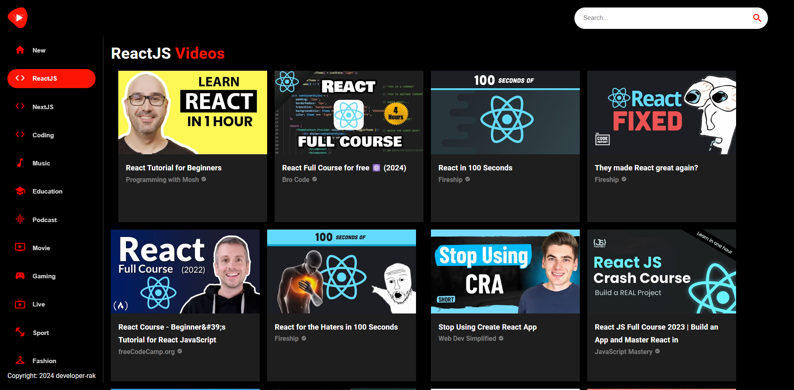

# :closed_book: Youtube Clone app

### _youtube clone app using react !!_

### Link :link: https://rak-youtubeclone.netlify.app/

## Interface

## Run Locally

  - Run This command `https://github.com/developer-rak/youtube_clone_app.git`
  - You are now in the dev environment and you can play around

## ✨ Features

  - All videos (education, music, tutorials etc)
  - Open Source (Tweak it and use it)

## ⚙️ Tech Stack
  - HTML5
  - React
  - Material UI
  - MUI icons
  - axios
  - react-player
  - Netlify
